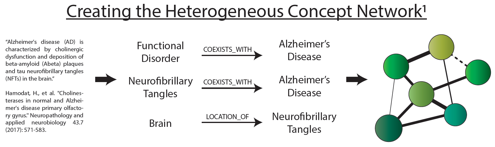

.. _Data:

Data Details
============

SemNet is a Python package for extracting insights from semantic networks. It was built around semantic predication data from the `Semantic MEDLINE Database`_ (SemMedDB). This data consists of nearly 100 million subject-predicate-object triples extracted from all PubMed citations (about 28 million as of December 2017) using string similarity techniques. To get a feel for the type of data we are working with, check out these lists of `node types`_ (found in subjects and objects) and `edge types`_ (found in predicates). Keep in mind that each node has an identity and a type, and that these are distinct. An example of a node type might be “Amino Acid, Peptide, or Protein”, while its identity might be “amyloid-:math:`\beta`”.

The PREDICATIONS table from SemMedDB (VER31R, processed up to December 31, 2017) was `downloaded`_ in May 2018. To allow more efficient neighbor queries, it was modified from its original form and imported into a Neo4j graph database. Specifically, we started by aggregating the 100 million predications down to about 20 million unique predications. For each unique predication, we recorded the number of times it was found (edge weight) and the PMID’s of the source citations. We also added the abbreviations of source and target node types to the edge types to save query time. Finally, for each unique node we recorded the number of times each node was referred to by different types, recorded types and counts, and assigned the most common type to each node. Edge labels referred to the most common node type for each node.

Node Data Fields
^^^^^^^^^^^^^^^^
+----------------+-----------------------------------------------------------------------+-------------------------+
| **Field**      | **Description**                                                       | **Example**             |
+----------------+-----------------------------------------------------------------------+-------------------------+
| ``name``       | A string that corresponds to the UMLS Metathesaurus term for the node | ``Alzheimer's disease`` |
+----------------+-----------------------------------------------------------------------+-------------------------+
| ``identifier`` | The UMLS Concept Unique Identifier for the node                       | ``C0002395``            |
+----------------+-----------------------------------------------------------------------+-------------------------+
| ``kind``       | The most common type assigned to the node by SemRep                   | ``DiseaseOrSyndrome``   |
+----------------+-----------------------------------------------------------------------+-------------------------+
| ``alt_kinds``  | The set of all types that were assigned to this node by SemRep        | ``DSYN,PATF,ANAB``      |
+----------------+-----------------------------------------------------------------------+-------------------------+
| ``alt_counts`` | The number of times each of the types in alt_kinds was assigned       | ``184391,1,1``          |
+----------------+-----------------------------------------------------------------------+-------------------------+

Edge Data Fields
^^^^^^^^^^^^^^^^
+---------------+-----------------------------------------------------------------------------------------------+-------------------------------------------------------------------------------------------------------+
| **Field**     | **Description**                                                                               | **Example**                                                                                           |
+---------------+-----------------------------------------------------------------------------------------------+-------------------------------------------------------------------------------------------------------+
| ``source``    | The node representing the subject of the predication                                          | ``Amyloid beta-Protein``                                                                              |
+---------------+-----------------------------------------------------------------------------------------------+-------------------------------------------------------------------------------------------------------+
| ``target``    | The node representing the object of the predication                                           | ``Alzheimer's disease``                                                                               |
+---------------+-----------------------------------------------------------------------------------------------+-------------------------------------------------------------------------------------------------------+
| ``predicate`` | A string that represents the type of predication, along with types of source and target nodes | ``PREDISPOSES_AAPPpredDSYN``                                                                          |
+---------------+-----------------------------------------------------------------------------------------------+-------------------------------------------------------------------------------------------------------+
| ``weight``    | The total number of times the predication was found in the literature by SemRep               | ``10``                                                                                                |
+---------------+-----------------------------------------------------------------------------------------------+-------------------------------------------------------------------------------------------------------+
| ``pmid``      | The PubMed IDs of all publications that mentioned this predication                            | ``9558155, 11130287, 12753069, 16788245, 19695299, 23732272, 21813211, 27541273, 28827785, 29246249`` |
+---------------+-----------------------------------------------------------------------------------------------+-------------------------------------------------------------------------------------------------------+

Node Types
^^^^^^^^^^
+-------------------------------------+------------------+-------------------------------------------+------------------+
| **Node Type**                       | **Abbreviation** | **Node Type**                             | **Abbreviation** |
+-------------------------------------+------------------+-------------------------------------------+------------------+
| Acquired Abnormality                | ACAB             | Human-caused Phenomenon or Process        | HCPP             |
+-------------------------------------+------------------+-------------------------------------------+------------------+
| Activity                            | ACTY             | Idea or Concept                           | IDCN             |
+-------------------------------------+------------------+-------------------------------------------+------------------+
| Age Group                           | AGGP             | Immunologic Factor                        | IMFT             |
+-------------------------------------+------------------+-------------------------------------------+------------------+
| Algae                               | ALGA             | Indicator Reagent or Diagnostic Aid       | IDRA             |
+-------------------------------------+------------------+-------------------------------------------+------------------+
| Amino Acid Peptide or Protein       | AAPP             | Individual Behavior                       | INBE             |
+-------------------------------------+------------------+-------------------------------------------+------------------+
| Amino Acid Sequence                 | AMAS             | Infectious Organism                       | RICH             |
+-------------------------------------+------------------+-------------------------------------------+------------------+
| Amphibian                           | AMPH             | Injury or Poisoning                       | INPO             |
+-------------------------------------+------------------+-------------------------------------------+------------------+
| Anatomical Abnormality              | ANAB             | Inorganic Chemical                        | INCH             |
+-------------------------------------+------------------+-------------------------------------------+------------------+
| Anatomical Structure                | ANST             | Intellectual Product                      | INPR             |
+-------------------------------------+------------------+-------------------------------------------+------------------+
| Animal                              | ANIM             | Invertebrate                              | INVT             |
+-------------------------------------+------------------+-------------------------------------------+------------------+
| Antibiotic                          | ANTB             | Laboratory Procedure                      | LBPR             |
+-------------------------------------+------------------+-------------------------------------------+------------------+
| Archaeon                            | ARCH             | Laboratory or Test Result                 | LBTR             |
+-------------------------------------+------------------+-------------------------------------------+------------------+
| Bacterium                           | BACT             | Language                                  | LANG             |
+-------------------------------------+------------------+-------------------------------------------+------------------+
| Behavior                            | BHVR             | Lipid                                     | LIPD             |
+-------------------------------------+------------------+-------------------------------------------+------------------+
| Biologic Function                   | BIOF             | Machine Activity                          | MCHA             |
+-------------------------------------+------------------+-------------------------------------------+------------------+
| Biologically Active Substance       | BACS             | Mammal                                    | MAMM             |
+-------------------------------------+------------------+-------------------------------------------+------------------+
| Biomedical Occupation or Discipline | BMOD             | Manufactured Object                       | MNOB             |
+-------------------------------------+------------------+-------------------------------------------+------------------+
| Biomedical or Dental Material       | BODM             | Medical Device                            | MEDD             |
+-------------------------------------+------------------+-------------------------------------------+------------------+
| Bird                                | BIRD             | Mental Process                            | MENP             |
+-------------------------------------+------------------+-------------------------------------------+------------------+
| Body Location or Region             | BLOR             | Mental or Behavioral Dysfunction          | MOBD             |
+-------------------------------------+------------------+-------------------------------------------+------------------+
| Body Part Organ or Organ Component  | BPOC             | Molecular Biology Research Technique      | MBRT             |
+-------------------------------------+------------------+-------------------------------------------+------------------+
| Body Space or Junction              | BSOJ             | Molecular Function                        | MOFT             |
+-------------------------------------+------------------+-------------------------------------------+------------------+
| Body Substance                      | BDSU             | Molecular Sequence                        | MOSQ             |
+-------------------------------------+------------------+-------------------------------------------+------------------+
| Body System                         | BDSY             | Natural Phenomenon or Process             | NPOP             |
+-------------------------------------+------------------+-------------------------------------------+------------------+
| Carbohydrate                        | CARB             | Neoplastic Process                        | NEOP             |
+-------------------------------------+------------------+-------------------------------------------+------------------+
| Cell                                | CELL             | Neuroreactive Substance or Biogenic Amine | NSBA             |
+-------------------------------------+------------------+-------------------------------------------+------------------+
| Cell Component                      | CELC             | Nucleic Acid Nucleoside or Nucleotide     | NNON             |
+-------------------------------------+------------------+-------------------------------------------+------------------+
| Cell Function                       | CELF             | Nucleotide Sequence                       | NUSQ             |
+-------------------------------------+------------------+-------------------------------------------+------------------+
| Cell or Molecular Dysfunction       | COMD             | Occupation or Discipline                  | OCDI             |
+-------------------------------------+------------------+-------------------------------------------+------------------+
| Chemical                            | CHEM             | Occupational Activity                     | OCAC             |
+-------------------------------------+------------------+-------------------------------------------+------------------+
| Chemical Viewed Functionally        | CHVF             | Organ or Tissue Function                  | ORTF             |
+-------------------------------------+------------------+-------------------------------------------+------------------+
| Chemical Viewed Structurally        | CHVS             | Organic Chemical                          | ORCH             |
+-------------------------------------+------------------+-------------------------------------------+------------------+
| Classification                      | CLAS             | Organism                                  | ORGM             |
+-------------------------------------+------------------+-------------------------------------------+------------------+
| Clinical Attribute                  | CLNA             | Organism Attribute                        | ORGA             |
+-------------------------------------+------------------+-------------------------------------------+------------------+
| Clinical Drug                       | CLND             | Organism Function                         | ORGF             |
+-------------------------------------+------------------+-------------------------------------------+------------------+
| Conceptual Entity                   | CNCE             | Organization                              | ORGT             |
+-------------------------------------+------------------+-------------------------------------------+------------------+
| Congenital Abnormality              | CGAB             | Organophosphorus Compound                 | OPCO             |
+-------------------------------------+------------------+-------------------------------------------+------------------+
| Daily or Recreational Activity      | DORA             | Pathologic Function                       | PATF             |
+-------------------------------------+------------------+-------------------------------------------+------------------+
| Diagnostic Procedure                | DIAP             | Patient or Disabled Group                 | PODG             |
+-------------------------------------+------------------+-------------------------------------------+------------------+
| Disease or Syndrome                 | DSYN             | Pharmacologic Substance                   | PHSU             |
+-------------------------------------+------------------+-------------------------------------------+------------------+
| Drug Delivery Device                | DRDD             | Phenomenon or Process                     | PHPR             |
+-------------------------------------+------------------+-------------------------------------------+------------------+
| Educational Activity                | EDAC             | Physical Object                           | PHOB             |
+-------------------------------------+------------------+-------------------------------------------+------------------+
| Eicosanoid                          | EICO             | Physiologic Function                      | PHSF             |
+-------------------------------------+------------------+-------------------------------------------+------------------+
| Element Ion or Isotope              | ELII             | Plant                                     | PLNT             |
+-------------------------------------+------------------+-------------------------------------------+------------------+
| Embryonic Structure                 | EMST             | Population Group                          | POPG             |
+-------------------------------------+------------------+-------------------------------------------+------------------+
| Environmental Effect of Humans      | EEHU             | Professional Society                      | PROS             |
+-------------------------------------+------------------+-------------------------------------------+------------------+
| Enzyme                              | ENZY             | Professional or Occupational Group        | PROG             |
+-------------------------------------+------------------+-------------------------------------------+------------------+
| Event                               | EVNT             | Qualitative Concept                       | QLCO             |
+-------------------------------------+------------------+-------------------------------------------+------------------+
| Experimental Model of Disease       | EMOD             | Quantitative Concept                      | QNCO             |
+-------------------------------------+------------------+-------------------------------------------+------------------+
| Family Group                        | FAMG             | Receptor                                  | RCPT             |
+-------------------------------------+------------------+-------------------------------------------+------------------+
| Finding                             | FNDG             | Regulation or Law                         | RNLW             |
+-------------------------------------+------------------+-------------------------------------------+------------------+
| Fish                                | FISH             | Reptile                                   | REPT             |
+-------------------------------------+------------------+-------------------------------------------+------------------+
| Food                                | FOOD             | Research Activity                         | RESA             |
+-------------------------------------+------------------+-------------------------------------------+------------------+
| Fully Formed Anatomical Structure   | FFAS             | Research Device                           | RESD             |
+-------------------------------------+------------------+-------------------------------------------+------------------+
| Functional Concept                  | FTCN             | Self-help or Relief Organization          | SHRO             |
+-------------------------------------+------------------+-------------------------------------------+------------------+
| Fungus                              | FNGS             | Sign or Symptom                           | SOSY             |
+-------------------------------------+------------------+-------------------------------------------+------------------+
| Gene or Genome                      | GNGM             | Social Behavior                           | SOCB             |
+-------------------------------------+------------------+-------------------------------------------+------------------+
| Genetic Function                    | GENF             | Spatial Concept                           | SPCO             |
+-------------------------------------+------------------+-------------------------------------------+------------------+
| Geographic Area                     | GEOA             | Steroid                                   | STRD             |
+-------------------------------------+------------------+-------------------------------------------+------------------+
| Governmental or Regulatory Activity | GORA             | Substance                                 | SBST             |
+-------------------------------------+------------------+-------------------------------------------+------------------+
| Group                               | GRUP             | Temporal Concept                          | TMCO             |
+-------------------------------------+------------------+-------------------------------------------+------------------+
| Group Attribute                     | GRPA             | Therapeutic or Preventive Procedure       | TOPP             |
+-------------------------------------+------------------+-------------------------------------------+------------------+
| Hazardous or Poisonous Substance    | HOPS             | Tissue                                    | TISU             |
+-------------------------------------+------------------+-------------------------------------------+------------------+
| Health Care Activity                | HLCA             | Vertebrate                                | VTBT             |
+-------------------------------------+------------------+-------------------------------------------+------------------+
| Health Care Related Organization    | HCRO             | Virus                                     | VIRS             |
+-------------------------------------+------------------+-------------------------------------------+------------------+
| Hormone                             | HORM             | Vitamin                                   | VITA             |
+-------------------------------------+------------------+-------------------------------------------+------------------+
| Human                               | HUMN             |                                           |                  |
+-------------------------------------+------------------+-------------------------------------------+------------------+

Edge Types
^^^^^^^^^^
+---------------------+------------------+----------------------+------------------+
| **Edge Type**       | **Abbreviation** | **Edge Type**        | **Abbreviation** |
+---------------------+------------------+----------------------+------------------+
| administered_to     | adto             | neg_disrupts         | ndrpt            |
+---------------------+------------------+----------------------+------------------+
| affects             | afct             | neg_higher_than      | nhght            |
+---------------------+------------------+----------------------+------------------+
| associated_with     | aswt             | neg_inhibits         | ninhb            |
+---------------------+------------------+----------------------+------------------+
| augments            | augm             | neg_interacts_with   | nitaw            |
+---------------------+------------------+----------------------+------------------+
| causes              | caus             | neg_location_of      | nlocf            |
+---------------------+------------------+----------------------+------------------+
| coexists_with       | cxwt             | neg_lower_than       | nlowt            |
+---------------------+------------------+----------------------+------------------+
| compared_with       | cpwt             | neg_manifestation_of | nmanf            |
+---------------------+------------------+----------------------+------------------+
| complicates         | cmpc             | neg_method_of        | nmthf            |
+---------------------+------------------+----------------------+------------------+
| converts_to         | cvtt             | neg_occurs_in        | noccn            |
+---------------------+------------------+----------------------+------------------+
| diagnoses           | diag             | neg_part_of          | nprtf            |
+---------------------+------------------+----------------------+------------------+
| different_from      | diff             | neg_precedes         | nprcd            |
+---------------------+------------------+----------------------+------------------+
| disrupts            | drpt             | neg_predisposes      | npred            |
+---------------------+------------------+----------------------+------------------+
| higher_than         | hght             | neg_prevents         | nprev            |
+---------------------+------------------+----------------------+------------------+
| inhibits            | inhb             | neg_process_of       | nprcf            |
+---------------------+------------------+----------------------+------------------+
| interacts_with      | itaw             | neg_produces         | nprod            |
+---------------------+------------------+----------------------+------------------+
| isa                 | isa              | neg_stimulates       | nstim            |
+---------------------+------------------+----------------------+------------------+
| location_of         | locf             | neg_treats           | ntrts            |
+---------------------+------------------+----------------------+------------------+
| lower_than          | lowt             | neg_uses             | nuses            |
+---------------------+------------------+----------------------+------------------+
| manifestation_of    | manf             | occurs_in            | occn             |
+---------------------+------------------+----------------------+------------------+
| method_of           | mthf             | part_of              | prtf             |
+---------------------+------------------+----------------------+------------------+
| neg_administered_to | nadto            | precedes             | prcd             |
+---------------------+------------------+----------------------+------------------+
| neg_affects         | nafct            | predisposes          | pred             |
+---------------------+------------------+----------------------+------------------+
| neg_associated_with | naswt            | prevents             | prev             |
+---------------------+------------------+----------------------+------------------+
| neg_augments        | naugm            | process_of           | prcf             |
+---------------------+------------------+----------------------+------------------+
| neg_causes          | ncaus            | produces             | prod             |
+---------------------+------------------+----------------------+------------------+
| neg_coexists_with   | ncxwt            | same_as              | same             |
+---------------------+------------------+----------------------+------------------+
| neg_complicates     | ncmpc            | stimulates           | stim             |
+---------------------+------------------+----------------------+------------------+
| neg_converts_to     | ncvtt            | treats               | trts             |
+---------------------+------------------+----------------------+------------------+
| neg_diagnoses       | ndiag            | uses                 | uses             |
+---------------------+------------------+----------------------+------------------+

.. _Semantic MEDLINE Database: https://www.ncbi.nlm.nih.gov/pmc/articles/PMC3509487/
.. _node types: https://www.nlm.nih.gov/research/umls/META3_current_semantic_types.html
.. _edge types: https://www.nlm.nih.gov/research/umls/META3_current_relations.html
.. _downloaded: https://skr3.nlm.nih.gov/SemMedDB/download/download.html
