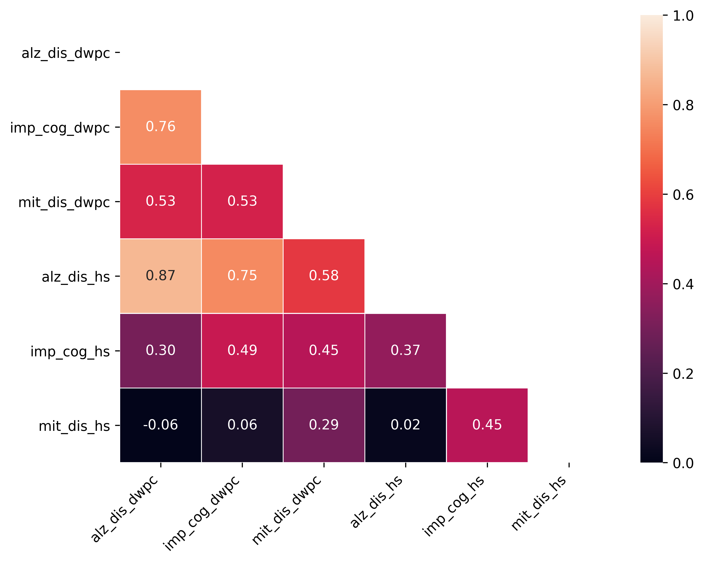
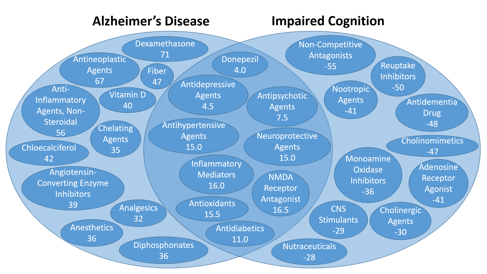

Rank Aggregation
================

Overview
--------

After we have computed vectorized representations of the connections between source-target pairs using the :ref:`FeatExtract` modules, we will want to extract useful knowledge from these feature vectors. We have found it useful to run a ranking aggregation algorithm on these features [#]_. This algorithm treats each metapath-based feature as an independent ranker that ranks each source node with respect to each target node. We learn weights of individual metapath rankings based on their agreement with the average ranking across all source nodes.

Usage
-----

Aggregating Ranks
^^^^^^^^^^^^^^^^^

We use :class:`semnet.rank_agg.UnsupervisedRankAggregator` to produce rankings of source nodes with respect to target nodes. Each object has an associated ``xarray.DataArray`` dataset (here, ``hs_data``) from the feature extraction step and a ``cui2name`` dictionary. The associated function, ``aggregate``, turns feature scores into rankings and finds the optimal linear weights for individual rankers to produce the final aggregate ranking. The end result is a ``pandas.Series`` of ranked CUI's, which we typically convert into their verbose form. The necessary data for defining ``cui2name`` can be found in the ``all_nodes.tsv.gz`` data file in SemNet.

.. code-block:: python

    import pickle
    from semnet.rank_agg import UnsupervisedRankAggregator

    hs_ura = UnsupervisedRankAggregator(hs_data, cui2name)
    _ = hs_ura.aggregate('hetesim', target_cui, theta=1000)
    hs_scores = np.dot(hs_ura.rankings, hs_ura.weights)
    hs_scores = {cui:score for cui, score in zip(hs_ura.sources, hs_scores)}
    hs_ranks = pd.Series(hs_scores).rank(method='dense')

.. warning:: Output from the HeteSim function does not currently include the ``metric`` dimension, which is expected by ``UnsupervisedRankAggregator``. It can be added using:

    .. code-block:: python

        hs_data = hs_data.assign_coords(metric='hetesim')
                         .expand_dims('metric')
                         .transpose('source', 'target', 'metapath', 'metric')

Aggregate Rank Pairplots
^^^^^^^^^^^^^^^^^^^^^^^^

Once we have rankings indexed by CUI and target node, we can easily concatenate these ``pandas.Series`` into a ``pandas.DataFrame`` and take advantage of the plotting capabilities of ``pandas`` and ``seaborn`` to produce meaningful visualizations.

A pairplot can be useful for visualizing a high-dimensional scatterplot using two-variable projections.

.. code-block:: python

    import pandas as pd
    import matplotlib.pyplot as plt
    import seaborn as sns

    # Producing a pairplot
    all_hs_ranks = pd.DataFrame([hs_ranks_t1, hs_ranks_t2, hs_ranks_t3],
                                index=['hs_ranks_t1', 'hs_ranks_t2', 'hs_ranks_t3']).T
    sns.pairplot(all_hs_ranks)
    plt.savefig('hs_rankings_pairplot.png', bbox_inches='tight')
    plt.show()

.. image:: _static/pairplot.png

Aggregate Rank Correlation
^^^^^^^^^^^^^^^^^^^^^^^^^^

A ranking correlation heatmap can be useful for quantifying the agreement between aggregate rankers.

.. code-block:: python

    from scipy.stats import kendalltau

    # Producing a ranking correlation heatmap

    # Compute standard correlation
    corr = all_hs_ranks.corr()
    mask = np.zeros_like(corr, dtype=np.bool)
    mask[np.triu_indices_from(mask)] = True

    # Compute Kendall's tau ranking correlation
    plt.figure(figsize=(8, 6))
    kendall_df = pd.DataFrame()
    for i, i_col in enumerate(all_hs_ranks):
        vec = pd.Series()
        for j, j_col in enumerate(all_hs_ranks):
            vec[j_col] = kendalltau(all_hs_ranks[i_col], all_hs_ranks[j_col])[0]
        kendall_df[i_col] = pd.Series(vec)
    sns.heatmap(kendall_df, vmax=1, vmin=0,
                annot=True, fmt=".2f",
                linewidths=.5, mask=mask)
    plt.xticks(rotation=45, ha='right')
    plt.savefig('hs_rankings_corr.png', bbox_inches='tight')

Aggregate Rank Residuals
^^^^^^^^^^^^^^^^^^^^^^^^

Another intuitive measure of comparison between target nodes is the nodes which are ranked significantly higher by one ranker than the other. We call these numbers the rank residuals, and they can be calculated by simply subtracting one set of rankings from another set of rankings. Residuals are shown in the Venn Diagram below. Another intuitive measure, which is not exemplified here because of its simplicity, is to find the similarly ranked sources by averaging across targets. High mean rankings are shown in the center of the Venn Diagram.

.. code-block:: python

    # Ranked higher with respect to target 1 -> positive
    # Ranked higher with respect to target 2 -> negative
    resid = (all_hs_ranks['hs_ranks_t2'] - all_hs_ranks['hs_ranks_t1']).sort_values(ascending=False)
    resid = pd.Series({cui2name[cui]: residual for cui, residual in resid.items()})

.. note:: These plots and figures do not correspond to the code given. The code has been simplified for clarity.

.. [#] Klementiev, Alexandre, Dan Roth, and Kevin Small. "An unsupervised learning algorithm for rank aggregation." European Conference on Machine Learning. Springer, Berlin, Heidelberg, 2007.
